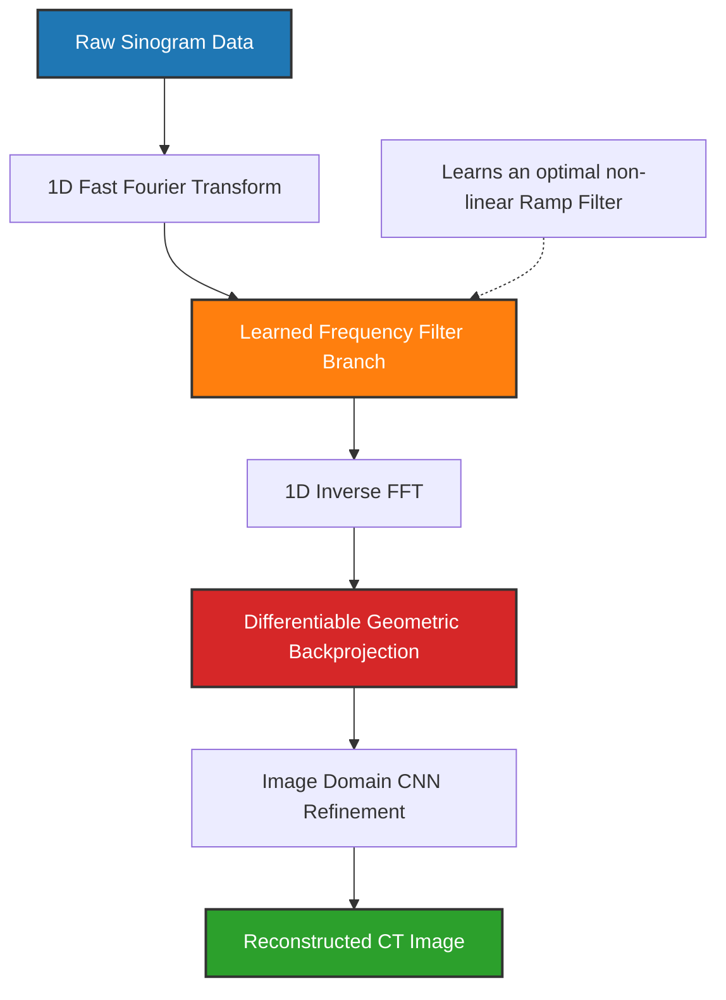

# 🏥 POSTER: High-Fidelity CT Reconstruction - Bridging Physics and Deep Learning

## 1. Abstract & Motivation
Computed Tomography (CT) reconstruction is fundamentally an inverse problem. Traditionally, the field relies on Filtered Back Projection (FBP) to convert raw sinogram projections back into image space. However, FBP suffers from severe artifacts when dealing with sparse-view or high-noise data (low-dose CT). 

While modern Deep Learning (DL) has attempted to solve this by post-processing FBP images (e.g., RED-CNN, U-Net), this approach is fundamentally flawed: it forces the neural network to "un-learn" the artifacts baked in by the classical FBP operator. 

**Our Objective:** Reconstruct images directly from the raw projection data (sinograms).

---

## 2. The Physics of CT & The Radon Transform
CT scanners measure X-ray attenuation. Mathematically, this is described by the **Radon Transform** ($\mathcal{R}$):

$$ p(s, \theta) = \int_{x \cos\theta + y \sin\theta = s} f(x, y) \, du $$

Where:
*   $f(x, y)$ is our target tissue density (the image).
*   $p(s, \theta)$ is the measured ray at angle $\theta$ and detector offset $s$.

The classical inversion algorithm, **Filtered Back Projection (FBP)**, applies a high-pass ramp filter in the frequency domain, followed by a backprojection operator ($\mathcal{R}^{-1}$):

$$ f(x,y) = \int_0^\pi \int_{-\infty}^\infty |w| \cdot P(w, \theta) e^{2\pi i w (x \cos\theta + y \sin\theta)} \, dw \, d\theta $$

---

## 3. The Mathematical "Global vs. Local" Challenge
Why can't we just feed a raw sinogram into a standard 2D U-Net?
**Because of the geometry of the Radon Transform.**

A single point anomaly (like a tumor) in the image $f(x,y)$ traces out a **global sine wave** across the entire sinogram $p(s, \theta)$. 
Standard Convolutional Neural Networks (CNNs) rely on local $3 \times 3$ translationally invariant kernels. They cannot naturally correlate the widely dispersed sine wave pixels. If we force a CNN to learn this, the parameter count explodes (e.g., AUTOMAP requires dense layers with billions of weights).

---

## 4. Our Architecture: FreqHybridNet (Branch B)
We utilize a physically informed hybrid architecture combining the best of explicit physics and adaptive deep learning without the intractable compilation dependencies of explicit unrolled optimization (Learned Primal-Dual).

### Infographic: Pipeline Architecture

### Why FreqHybridNet is the Best Strategic Path Today:
1. **Mathematical Soundness:** By applying a 1D FFT over the projection dimension, the network learns an ideal filter customized directly to the specific noise profile of the dataset, outperforming static classical ramp filters.
2. **Geometric Fidelity:** It explicitly backprojects the filtered sinogram into image space, solving the "global vs local" anomaly.
3. **Execution Reliability:** Implemented entirely in native PyTorch tensors, requiring zero strict rigid C++ dependencies (unlike ASTRA/ODL), rendering it safe for urgent deployments.

---

## 5. Branch A Backup: Learned Primal-Dual (LPD)
In parallel, a highly experimental branch is exploring **Learned Primal-Dual**. LPD represents the holy grail of reconstruction.
It unrolls the proximal gradient descent algorithm for optimizing data consistency and structural priors into a staggered neural network pipeline:

$$ h_{k+1} = \Lambda_{\theta_k} \left( h_k, \mathcal{R} f_k - p \right) $$
$$ f_{k+1} = \Gamma_{\phi_k} \left( f_k, \mathcal{R}^* h_{k+1} \right) $$

**Status:** Currently under separate isolation to mitigate timeline risks introduced by non-trivial gradient calculations through $\mathcal{R}$ on GPU.